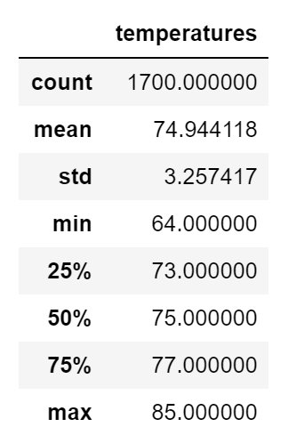
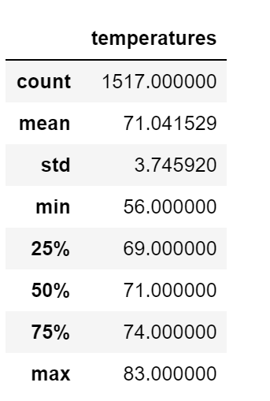
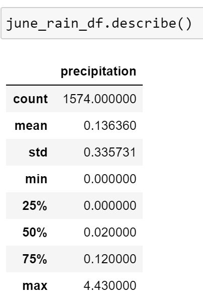
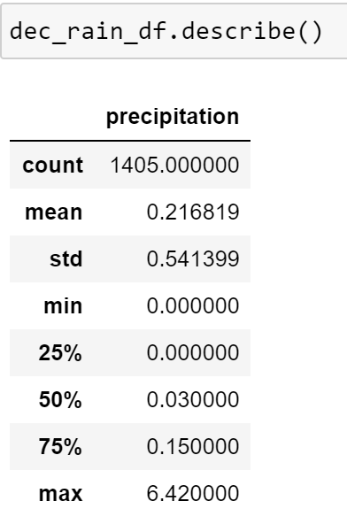

# surfs_up

# Module 9 Challenge - Surfs Up

# Overview of Statistical Analysis

Provide temperature data using tools Python to code in a Jupyter notebook, a SQLite databse of
the Hawaii weather and SQLAlchemy to query the data.

A surf and ice cream shop is a possible business idea to be able to live on the island of Oahu 
full time but you need and investor. W. Avy loves surfing and would like to invest but since
a previous business venture failed due to the weather, he requests weather analysis. W. Avy 
would like you to use a weather dataset from the island of Oahu stored as a SQLite database.

The analysis should be well documented for the future possibility of opening other shops.

2. Results

- There are more temperatures gathered in June (total of 1700) versus in December (total of 1517). 
The difference could have either a negative or positive impact on the statistics.

- Temperatures in December range anywhere from two to ten degrees cooler than in June. The average
temperature differs by three degrees with an average of 74 degrees in June and 71 degrees
in December.

- The temperatures differ between a minimum of two degrees to 8 degrees however the maximum
temperatures only differ by two degrees.

3. Summary

From the Hawaii weather database selected the temperatures in the months of June and December.
There were fewer temperatures measured in December (1517) versus June (1700) which could affect
the statistics. The precipiation was not initially measured which would impact either months.

Additional two queries to measure precipitation were also run and show the most amount of
precipitation occurs in December.

